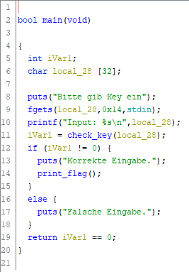
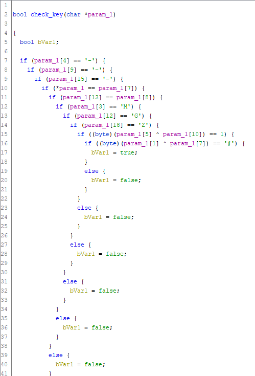

# Keychecker

Keychecker hatte den Vorteil, dass sie unstripped war und somit relativ flott zu reversen ging.
Man oeffnet also die keychecker binary in einem disassembler der Wahl und bekommt beim pseudocode output erstmal folgendes:

Nun sieht man schon die nette funktion mit dem Namen `check_key` welche den parameter `s` bekommt, also unser Ziel!

Wenn man nun in die funktion `check_key` schaut findet man Reihe an `if-statements` (zumindest im Disassembler).

Nun heisst es also einfach nurnoch einen key konstruieren, welcher diese Anforderungen erfuellt.

So kam ich dann auf `_|_M-^__G-__G__-__Z`.
Anschliessend einfach via nc connecten und die flage holen `DBH{35_d4rf_w13d3r_634ck7_w3rd3n}`

